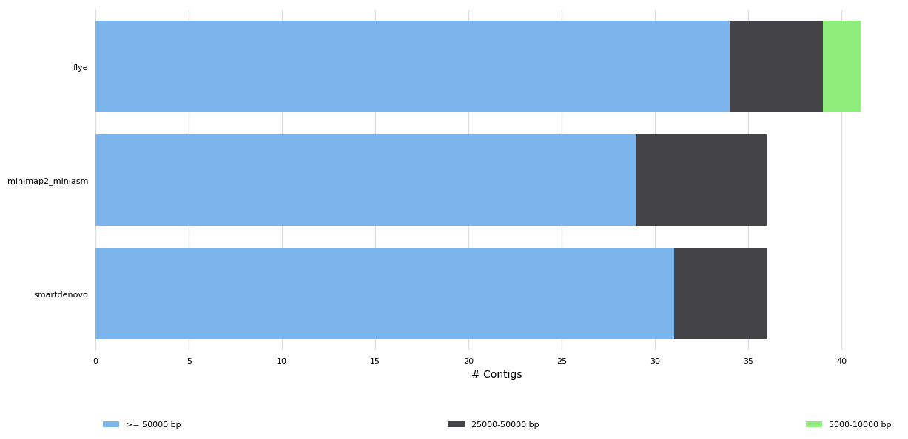
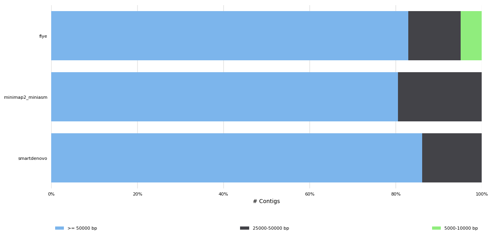
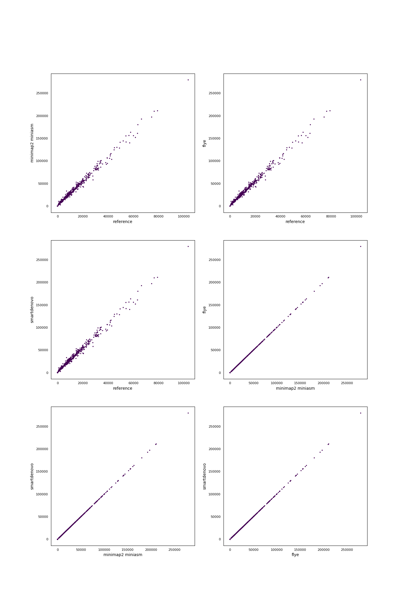
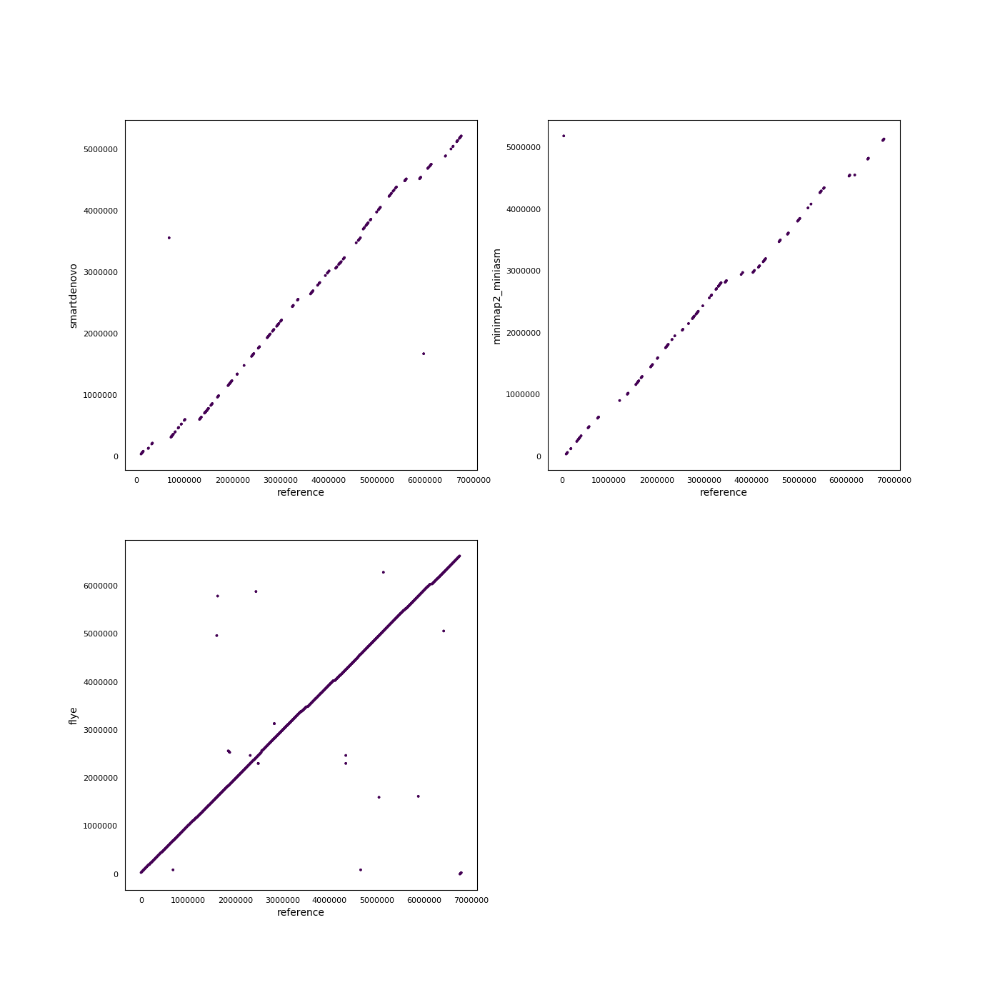

# Assembler benchmark for ONT MinION data
#### Authors: S. Nicholls and J. Quick, N. Loman
Generated using [poreTally](https://github.com/cvdelannoy/poreTally), a benchmarking tool. For an interactive version of this report, download REPORT.html from this repository.

<h2>Abstract</h2>The MinION is a portable DNA sequencer that generates long error-prone reads. As both the hardware and analysis software are updated regularly, the most suitable pipeline for subsequent analyses of a dataset generated with a given combination of hardware and software for a given organism is not always clear. Here we present a benchmark for a selection of <i>de novo</i> assemblers available to MinION users, on a read set of <i>Pseudomonas aeruginosa</i> (NCBI taxID: 287). This benchmark is based on a <a href=\>benchmarking routine</a>, designed to facilitate easy replication on a read set of choice and addition of other <i>de novo</i> assembly pipelines.<h2>Methods</h2><h3>Readset quality assessment</h3>Reads in this dataset were generated on a Minion with FLO-MIN106 flowcell with SQK-LSK109 kit. The reads were basecalled using Guppy v1.8.3. Prior to assembly, the quality of the untreated readset was analysed using NanoPlot (version: 1.19.0) and mapped using the mappy module (version: None) in Python3.<h3>Assembly pipelines</h3><h4>smartdenovo</h4>SMARTdenovo is a long read OLC assembly pipeline that was originally intended to work with PacBio reads, but has been shown to produce assemblies of reasonably high continuity from MinION reads as well. &zwnj; &zwnj;<b>Included tools:</b><ul><li>smartdenovo (version: 1.0.0) </li></ul> &zwnj;<b>Used command:</b><pre><code>smartdenovo.pl -p smartdenovo_assembly {input.fastq} > smartdenovo_assembly.mak
make -f smartdenovo_assembly.mak
if [ -e smartdenovo_assembly.cns ]; then mv smartdenovo_assembly.cns {output}; elif [ -e smartdenovo_assembly.dmo.lay.utg ]; then mv smartdenovo_assembly.dmo.lay.utg {output}; fi
</code></pre><h4>minimap2 miniasm</h4>Minimap2 is a fast all-vs-all mapper of reads that relies on sketches of sequences, composed of minimizers. Miniasm uses the found overlaps to construct an assembly graph. As a consensus step is lacking in this pipeline, post-assembly polishing is often required. &zwnj; &zwnj;<b>Included tools:</b><ul><li>minimap2 (version: 2.14-r883) </li><li>miniasm (version: 0.3-r179) </li></ul> &zwnj;<b>Used command:</b><pre><code>minimap2 -x ava-ont -t 4 {input.fastq} {input.fastq} | gzip -1 > minimap2.paf.gz
miniasm -f {input.fastq} minimap2.paf.gz > minimap2_miniasm.gfa
grep -Po '(?<=S\t)utg.+\s[ACTG]+' minimap2_miniasm.gfa | awk '{{print ">"$1"\\n"$2}}' | fold > {output}
</code></pre><h4>flye</h4>Flye uses A-Bruijn graphs to assemble long error-prone reads. To do so, it follows arbitrary paths through the assembly graph and constructs new assembly graphs from these paths. &zwnj; &zwnj;<b>Included tools:</b><ul><li>flye (version: 2.3.6-release) </li></ul> &zwnj;<b>Used command:</b><pre><code>flye --nano-raw {input.fastq} --genome-size 6791333 --out-dir . --threads 4
mv scaffolds.fasta {output}
</code></pre><h3>Assembly quality assessment</h3>Produced assemblies were analyzed and compared on continuity and agreement with the reference genome. Quast (version: 4.6.3) was used to determine a wide array of quality metrics in both quality categories and produce synteny plots. To elucidate any bias in the occurence of certain sequences, 5-mers in the assemblies and the reference genomes were compared using Jellyfish (version: 2.2.10). Finally, results were summarized using MultiQC.<h2>Results</h2><h3>General Statistics</h3><table>
<thead>
<tr><th style="text-align: center;">                </th><th style="text-align: center;"> N50  </th><th style="text-align: center;"> indels per 100 kbp </th><th style="text-align: center;"> peak CPU usage PSS MB </th><th style="text-align: center;"> Total length </th><th style="text-align: center;"> Genome fraction </th><th style="text-align: center;"> Wall time </th><th style="text-align: center;"> mismatches per 100 kbp </th></tr>
</thead>
<tbody>
<tr><td style="text-align: center;">minimap2_miniasm</td><td style="text-align: center;">251398</td><td style="text-align: center;">      3990.65       </td><td style="text-align: center;">        2335.35        </td><td style="text-align: center;"> 6.13228e+06  </td><td style="text-align: center;">     12.822      </td><td style="text-align: center;">  0:01:25  </td><td style="text-align: center;">        3758.34         </td></tr>
<tr><td style="text-align: center;">  smartdenovo   </td><td style="text-align: center;">253872</td><td style="text-align: center;">      3950.16       </td><td style="text-align: center;">         378.8         </td><td style="text-align: center;"> 6.29266e+06  </td><td style="text-align: center;">     19.013      </td><td style="text-align: center;">  0:20:44  </td><td style="text-align: center;">        3838.18         </td></tr>
<tr><td style="text-align: center;">      flye      </td><td style="text-align: center;">259261</td><td style="text-align: center;">       677.73       </td><td style="text-align: center;">        2555.09        </td><td style="text-align: center;"> 6.62072e+06  </td><td style="text-align: center;">     95.845      </td><td style="text-align: center;">  0:37:07  </td><td style="text-align: center;">         132.84         </td></tr>
</tbody>
</table><h3>Readset quality</h3>
<table>
<thead>
<tr><th style="text-align: center;">                          </th><th style="text-align: center;"> Value  </th><th style="text-align: center;">                 </th><th style="text-align: center;">    N    </th><th style="text-align: center;">  %  </th></tr>
</thead>
<tbody>
<tr><td style="text-align: center;"><b>Median read quality</b></td><td style="text-align: center;">  9.2   </td><td style="text-align: center;"><b>mismatches</b></td><td style="text-align: center;"> 9094559 </td><td style="text-align: center;">4.48 </td></tr>
<tr><td style="text-align: center;"><b>Median read length</b> </td><td style="text-align: center;">18,219.5</td><td style="text-align: center;"><b>insertions</b></td><td style="text-align: center;"> 7529304 </td><td style="text-align: center;">3.71 </td></tr>
<tr><td style="text-align: center;"> <b>Mean read length</b>  </td><td style="text-align: center;">19,384.3</td><td style="text-align: center;"><b>deletions</b> </td><td style="text-align: center;">10247383 </td><td style="text-align: center;">5.05 </td></tr>
<tr><td style="text-align: center;"> <b>Mean read quality</b> </td><td style="text-align: center;">  8.8   </td><td style="text-align: center;"> <b>matches</b>  </td><td style="text-align: center;">176226407</td><td style="text-align: center;">86.77</td></tr>
</tbody>
</table><h3>QUAST</h3><h4>Assembly Statistics</h4><table>
<thead>
<tr><th style="text-align: center;">                </th><th style="text-align: center;"> N50 (Kbp) </th><th style="text-align: center;"> L50 (K) </th><th style="text-align: center;"> Misas- semblies </th><th style="text-align: center;"> Indels /100Kbp </th><th style="text-align: center;"> L75 (K) </th><th style="text-align: center;"> Mismatches /100Kbp </th><th style="text-align: center;"> Length (Mbp) </th><th style="text-align: center;"> Largest contig (Kbp) </th><th style="text-align: center;"> N75 (Kbp) </th><th style="text-align: center;"> Genome Fraction </th></tr>
</thead>
<tbody>
<tr><td style="text-align: center;">minimap2_miniasm</td><td style="text-align: center;">  251398   </td><td style="text-align: center;">    8    </td><td style="text-align: center;">                 </td><td style="text-align: center;">    3990.65     </td><td style="text-align: center;">   15    </td><td style="text-align: center;">      3758.34       </td><td style="text-align: center;"> 6.13228e+06  </td><td style="text-align: center;">        830455        </td><td style="text-align: center;">  168381   </td><td style="text-align: center;">     12.822      </td></tr>
<tr><td style="text-align: center;">  smartdenovo   </td><td style="text-align: center;">  253872   </td><td style="text-align: center;">    8    </td><td style="text-align: center;">                 </td><td style="text-align: center;">    3950.16     </td><td style="text-align: center;">   16    </td><td style="text-align: center;">      3838.18       </td><td style="text-align: center;"> 6.29266e+06  </td><td style="text-align: center;">        838434        </td><td style="text-align: center;">  118621   </td><td style="text-align: center;">     19.013      </td></tr>
<tr><td style="text-align: center;">      flye      </td><td style="text-align: center;">  259261   </td><td style="text-align: center;">    8    </td><td style="text-align: center;">        1        </td><td style="text-align: center;">     677.73     </td><td style="text-align: center;">   17    </td><td style="text-align: center;">       132.84       </td><td style="text-align: center;"> 6.62072e+06  </td><td style="text-align: center;">        850194        </td><td style="text-align: center;">  121891   </td><td style="text-align: center;">     95.845      </td></tr>
</tbody>
</table><h4>Number of Contigs</h4>

<h3> <i>k</i>-mer Counts</h3>

<h3> Synteny Plots</h3>

<h3>CPU usage</h3>

CPU usage was monitored during runs using the psutil package in Python3. Reported here are CPU time and memory usage(proportional and unique set size, PSS and USS respectively).<table>
<thead>
<tr><th style="text-align: center;"> I/O in (MB/s) </th><th style="text-align: center;"> I/O out (MB/s) </th><th style="text-align: center;"> Wall time </th><th style="text-align: center;"> mean CPU load (MB) </th><th style="text-align: center;"> peak PSS (MB) </th><th style="text-align: center;"> peak USS (MB) </th></tr>
</thead>
<tbody>
<tr><td style="text-align: center;">     230.7     </td><td style="text-align: center;">      0.01      </td><td style="text-align: center;">  0:01:25  </td><td style="text-align: center;">         0          </td><td style="text-align: center;">    2335.35    </td><td style="text-align: center;">    2334.85    </td></tr>
<tr><td style="text-align: center;">     10.39     </td><td style="text-align: center;">     85.23      </td><td style="text-align: center;">  0:20:44  </td><td style="text-align: center;">         0          </td><td style="text-align: center;">     378.8     </td><td style="text-align: center;">    378.21     </td></tr>
<tr><td style="text-align: center;">     2.27      </td><td style="text-align: center;">    1752.59     </td><td style="text-align: center;">  0:37:07  </td><td style="text-align: center;">         0          </td><td style="text-align: center;">    2555.09    </td><td style="text-align: center;">    2554.32    </td></tr>
</tbody>
</table>